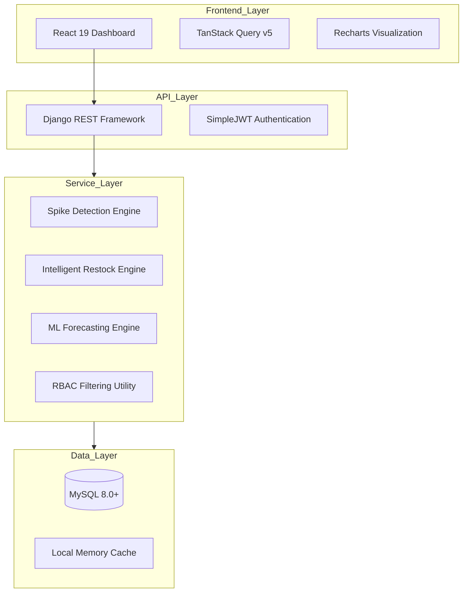
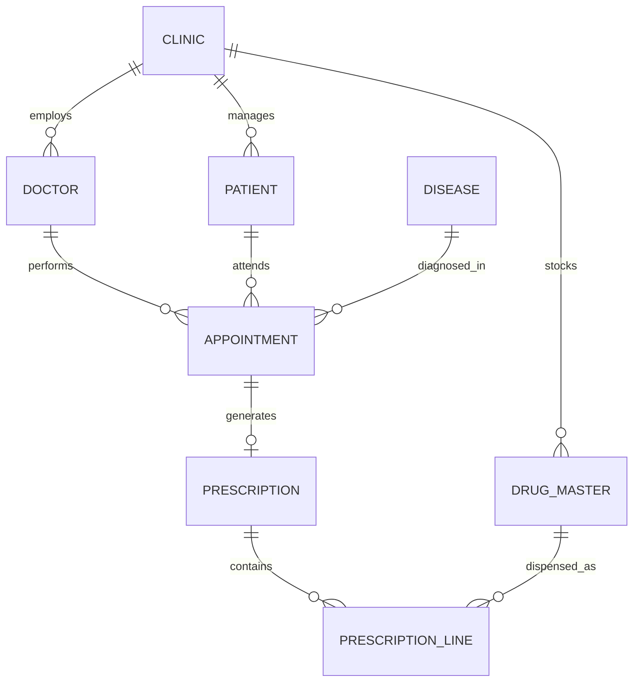

# 🏥 Healthcare AI Platform: Advanced Clinical Decision Support System

[](https://www.djangoproject.com/)
[](https://reactjs.org/)
[](https://www.mysql.com/)
[](backend/analytics/tests/)
[](LICENSE)

## 🌟 Overview
The **Healthcare AI Platform** is a sophisticated, enterprise-grade solution designed to revolutionize clinical operations through data-driven intelligence. By integrating statistical machine learning with clinical workflows, the platform provides real-time monitoring of disease outbreaks, intelligent pharmacy restock forecasting, and secure multi-tenant management for clinics.

This project is built for scalability, security, and high performance, utilizing a decoupled architecture that ensures clinical data integrity while providing lightning-fast analytics.

---

## 📑 Table of Contents
1. [Project Vision & Mission](#-project-vision--mission)
2. [System Architecture](#-system-architecture)
3. [Core Module Deep-Dive](#-core-module-deep-dive)
4. [Mathematical & ML Models](#-mathematical--ml-models)
5. [Technical Stack](#-technical-stack)
6. [Database Schema](#-database-schema)
7. [API Reference](#-api-reference)
8. [Installation & Cloning](#-installation--cloning)
9. [Contribution Guide](#-contribution-guide)
10. [Quality Assurance](#-quality-assurance)
11. [Troubleshooting & FAQ](#-troubleshooting--faq)
12. [License](#-license)

---

## 🎯 Project Vision & Mission
### Vision
To empower healthcare providers with predictive insights that transition clinical management from **reactive** to **proactive**.

### Mission
- **Eliminate Drug Stockouts**: Using demand forecasting to ensure life-saving medicines are always available.
- **Early Warning**: Detecting disease spikes before they evolve into large-scale outbreaks.
- **Data Democratization**: Providing clinical users with intuitive visualizations of complex epidemiological data.

---

## 🏗️ System Architecture
The platform implements a **Service-Oriented Architecture (SOA)** with a strict **Service-Layer Pattern**. This ensures that business logic is completely decoupled from the transport layer (REST API).



---

## 🧩 Core Module Deep-Dive

### 📈 1. Analytics & Epidemiological Engine
This module is the "brain" of the platform, processing thousands of clinical encounters to find patterns.
- **Spike Detection**: Implements statistical anomaly detection using rolling Z-scores. It identifies deviations from the 7-day baseline case volume.
- **Seasonality Engine**: Maps diseases to specific months and climate patterns (Summer, Monsoon, Winter) to adjust baseline expectations.
- **Trend Comparison**: Allows clinical administrators to compare current performance against previous periods (Weekly, Monthly, Yearly).

### 💊 2. Intelligent Inventory Management
Moving beyond simple inventory tracking, this module predicts future needs.
- **Adaptive Safety Buffer**: Automatically calculates additional stock requirements based on the "Risk Score" of currently spiking diseases.
- **Multi-Disease Aggregation**: A single drug (e.g., Paracetamol) is tracked across all associated clinical conditions it treats, providing a unified demand forecast.
- **Stock Depletion Forecasting**: Predicts the exact date of stockout (Days-to-Zero) using current consumption velocity and growth multipliers.

### 👥 3. Clinical Core & RBAC
Manages the fundamental entities of a healthcare system.
- **Multi-Tenancy**: Clinics operate in strict isolation. A `CLINIC_USER` can never access data from another clinic.
- **Entity Management**: Comprehensive CRUD operations for Patients, Doctors, and Clinics with deep relational integrity.

---

## 🧠 Mathematical & ML Models

### Z-Score Anomaly Detection
The system calculates a Z-score for every active disease daily:
$$Z = \frac{x - \mu}{\sigma}$$
Where:
- $x$ = Today's case count
- $\mu$ = Mean of the previous 7 days
- $\sigma$ = Standard deviation of the previous 7 days

**Thresholds:**
- `Z > 3.0`: **Warning Alert** (Yellow)
- `Z > 4.0`: **Critical Outbreak Alert** (Red)

### Demand Forecasting (Blended Model)
The forecasting engine uses a weighted blend:
1. **Weighted Moving Average (WMA)**: Assigns 60% weight to recent 3-day data and 40% to the 7-day history.
2. **Simple Exponential Smoothing (SES)**: Uses an $\alpha = 0.3$ to smooth out short-term fluctuations while maintaining trend sensitivity.

---

## 🛠️ Technical Stack

### Backend
- **Python 3.10+**: Core programming language.
- **Django 6.0**: High-level web framework.
- **Django REST Framework (DRF)**: API construction.
- **SimpleJWT**: Secure token-based authentication.
- **MySQL 8.0+**: Robust relational database management.

### Frontend
- **React 19**: Modern UI library using Functional Components and Hooks.
- **TanStack Query (React Query)**: Efficient server-state management and caching.
- **Recharts**: D3-based charting library for data visualization.
- **Axios**: HTTP client for API communication.
- **Vanilla CSS**: Premium styling with a focus on responsiveness and aesthetics.

---

## 📊 Database Schema



---

## 📡 API Reference

### 🔐 Authentication
- **POST** `/api/token/`: Obtain JWT Access & Refresh tokens.
- **POST** `/api/token/refresh/`: Refresh an expired access token.

### 📈 Analytics
| Method | Endpoint | Description |
| :--- | :--- | :--- |
| GET | `/api/disease-trends/` | Returns case volume trends. |
| GET | `/api/spike-alerts/` | Returns active statistical anomalies. |
| GET | `/api/seasonality/` | Returns seasonal distribution analysis. |

**Example Response (`/api/spike-alerts/`):**
```json
{
  "status": "success",
  "alerts": [
    {
      "disease_name": "Dengue Fever",
      "z_score": 4.2,
      "severity": "critical",
      "today_count": 45,
      "baseline_mean": 12.5
    }
  ]
}
```

---

## 🚀 Installation & Cloning

### 1. Clone the Repository
```bash
git clone https://github.com/haridharan0311/healthcare-ai.git
cd healthcare-ai
```

### 2. Backend Environment Setup
Create and activate a virtual environment:
```bash
python -m venv .venv
source .venv/bin/activate  # Linux/Mac
.venv\Scripts\activate     # Windows
```

Install dependencies:
```bash
pip install -r requirements.txt
```

### 3. Database Initialization
1. Ensure MySQL is running.
2. Create the database:
   ```sql
   CREATE DATABASE healthcare_ai;
   ```
3. Configure `.env` in the `backend/` directory:
   ```env
   DB_NAME=healthcare_ai
   DB_USER=your_user
   DB_PASSWORD=your_password
   DB_HOST=localhost
   DB_PORT=3306
   DEBUG=True
   ```
4. Run migrations:
   ```bash
   python manage.py migrate
   ```
5. Seed data:
   ```bash
   python manage.py import_data
   ```

### 4. Frontend Setup
```bash
cd frontend
npm install
npm start
```

---

## 🤝 Contribution Guide

We welcome contributions from the community! To maintain code quality, please follow these guidelines:

### Branching Strategy
- **main**: Production-ready code.
- **develop**: Integration branch for new features.
- **feature/**: New features (e.g., `feature/ai-integration`).
- **fix/**: Bug fixes.

### Pull Request Process
1. Fork the repository.
2. Create your feature branch (`git checkout -b feature/AmazingFeature`).
3. Commit your changes (`git commit -m 'Add some AmazingFeature'`).
4. Push to the branch (`git push origin feature/AmazingFeature`).
5. Open a Pull Request against the `develop` branch.

### Coding Standards
- **Python**: Follow PEP 8 guidelines. Use type hints for all service methods.
- **JavaScript**: Use ES6+ syntax, functional components, and descriptive prop-types.
- **Testing**: New features must include unit tests in the `tests/` directory.

---

## 🧪 Quality Assurance

The project includes a robust testing suite powered by `pytest`.

### Running Tests
Navigate to the `backend/` directory:
```bash
pytest analytics/tests/
```

### Test Coverage Includes:
- **ML Engine Tests**: Verifying forecast accuracy.
- **Security Tests**: Ensuring RBAC isolation and JWT integrity.
- **Robustness Tests**: Handling edge cases like zero-data or missing fields.
- **Integration Tests**: Verifying end-to-end API flows.

---

## ❓ Troubleshooting & FAQ

**Q: MySQL connection fails?**
- A: Ensure the `mysqlclient` or `mysql-connector-python` is correctly installed. Check if the MySQL service is running and credentials in `.env` are correct.

**Q: React build fails?**
- A: Delete `node_modules` and `package-lock.json`, then run `npm install`.

**Q: No data showing in dashboard?**
- A: Run `python manage.py import_data` to seed the database with initial CSV datasets.

---

## 📄 License
Distributed under the MIT License. See `LICENSE` for more information.

---

## 📧 Contact
**Project Lead**: Haridharan
**Link**: [https://github.com/haridharan0311/healthcare-ai](https://github.com/haridharan0311/healthcare-ai)

---

> "Empowering healthcare with intelligence, one data point at a time."
